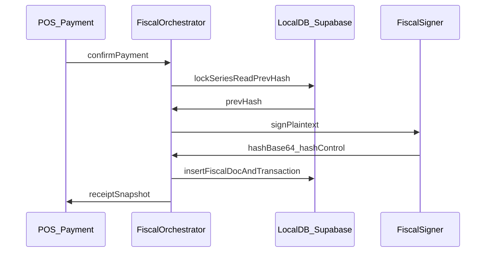

# Certification-ready POS (Portugal AT)

## Context (current gaps)

- Fiscal fields are computed in [`src/pages/POS.tsx`](src/pages/POS.tsx) (`generateATCUD`, `generateDocumentHash`) but **not** the same identifiers persisted by [`src/contexts/POSContext.tsx`](src/contexts/POSContext.tsx) `processTransaction` (separate `transaction_number` / `REC-...` receipt_number). Receipt and DB can **diverge**.
- [`src/utils/documentHash.ts`](src/utils/documentHash.ts) uses **SHA-256** over a custom payload; AT expects **RSA-SHA1** over `invoiceDate;systemEntryDate;invoiceNo;grossTotal;prevHash` (see [`certification requirements/hash-teste-node.js`](certification%20requirements/hash-teste-node.js) and PDF “Dados Técnicos”).
- No **SAF-T** export; no **`HashControl`** lifecycle; QR is **not** the `A:`…`R:` AT layout from the PDF.
- [`src/components/ThermalReceipt.tsx`](src/components/ThermalReceipt.tsx): wrong hash snippet (hex prefix vs **4 Base64 chars at positions 1,11,21,31**); footer text is noncompliant (`uGSU-…`); legal phrase must match **“Emitido por programa certificado n.º xxxx/AT”** (or approved equivalent).

Reference docs already in repo: PDF **Requisitos de Certificação…**, [`certification requirements/exemplo-xml.xml`](certification%20requirements/exemplo-xml.xml), XSD namespace **1.04_01**. Official XSD and AT QR technical note should be pinned as **normative** during implementation (pull from AT / recapitulativo if not vendored yet).

---

## Guiding principles (from PDF + code rules)

- **Single atomic fiscal commit**: allocate series number → build canonical signing string → sign → persist **immutable** row (hash never recomputed or edited) → then print / sync. Aligns with DEVELOPMENT_GUIDE error-handling and “no fixups after insert” fiscal rule.
- **Abstractions first (your choices)**: define `FiscalSigner` / `ATSeriesRegistry` interfaces so **Electron-local RSA** is the first implementation and **remote signer** can swap in without rewriting POS UI.
- **Manual ATCUD phase 1**: settings hold **AT validation code per registered series** (from Portal); app formats `ATCUD:` + code + `-` + sequential per PDF; **webservices** = later phase behind same registry interface.

---

## Phase 0 — Normative spec and gaps list (short, blocking)

- Freeze field mappings: **InvoiceNo**, **InvoiceType** (FT/FS/FR/NC/ND), **GrossTotal** definition for hash (must match SAFT `DocumentTotals` / line logic), **SystemEntryDate** (ISO with time), **customer NIF** when B2B.
- Cross-check PDF QR table against **AT-published** QR spec (PDF may abbreviate); add a single `PORTUGAL_FISCAL.md` or extend internal doc only if you choose to document (optional; code comments + tests preferred per your scope rule).

---

## Phase 1 — Data model: one fiscal truth linked to commerce

**Goal**: Every completed sale has exactly one **fiscal document** record containing everything needed for SAF-T and reprint.

- Add a dedicated entity (recommended) **`fiscal_documents`** (or extend `transactions` if you insist on one table — extension is messier for Supabase migrations):

  | Concept | Stored fields (minimum) |
  |--------|-------------------------|
  | Identity | `id`, `transaction_id` (nullable until linked), `series_internal_code`, `series_at_validation_code`, `sequential_number`, `invoice_no` (human `FT S/1`), `invoice_type` |
  | AT | `atcud_full` (e.g. `ATCUD:CSDF7T5H-35` or display form per final spec), `qr_payload` (exact string encoded in QR) |
  | Hash chain | `hash_base64`, `hash_control`, `signed_payload` (optional debug), `previous_fiscal_document_id` / `previous_hash_base64` |
  | Audit | `system_entry_date`, `source_user_id` / `source_id` string, `employee_number`, `certification_mode` (`production` \| `training`) |
  | Totals snapshot | `gross_total`, VAT breakdown, payment method, customer tax id snapshot |

- **Dexie**: new table + migration in [`src/lib/localDatabase.ts`](src/lib/localDatabase.ts) (version bump); indexes on `series_key + sequential`, `transaction_date`.
- **Supabase**: mirror columns or `fiscal_documents` table + RLS; extend [`src/services/transactionSyncService.ts`](src/services/transactionSyncService.ts) / RPC payloads so **hash and ATCUD sync** and are never overwritten by generic upsert.
- **Immutability**: DB layer forbid `UPDATE` on hash fields except disaster recovery (document explicitly); app uses **void + credit note** paths only.

---

## Phase 2 — Signing pipeline (hybrid: Electron-local first)

**Goal**: Replace [`generateDocumentHash`](src/utils/documentHash.ts) with AT-compliant signing.

- New module e.g. [`src/fiscal/signing.ts`](src/fiscal/signing.ts) (or `src/utils/fiscal/` per AGENTS file layout):
  - `buildHashPlaintext({ invoiceDate, systemEntryDate, invoiceNo, grossTotal, previousHash })` — `grossTotal` as `toFixed(2)`; `previousHash` `''` for first doc in series.
  - `signPlaintextRSA_SHA1(plaintext, privateKeyPem)` using **Web Crypto** (`RSA_PKCS1_v1_5` + `SHA-1`) in Electron renderer, or Node `crypto` in **preload/main** if renderer limitations appear (plan for preload bridge; keep verify path testable).
  - `hashControlForDocument()` reads from settings / key metadata (default `"1"` until key rotation).
  - `extractQrHashFourChars(hashBase64)` — indices **0-based for positions 1,11,21,31** = chars at index 0,10,20,30 of Base64 string; join with `-`.
- **`FiscalSigner` interface**: `signDocument(input) => { hashBase64, hashControl }`; implementation `ElectronWebCryptoSigner`; stub `RemoteSigner` (throws “not configured”) for future.
- **Private key handling**: import PEM from secure path; **never** commit keys; document in README/ops: generate with OpenSSL, load via settings file picker or env in dev; production: OS keychain (Electron `safeStorage` + path reference) — scoped as sub-milestone.

**Tests** (Vitest): vectors matching [`hash-teste-node.js`](certification%20requirements/hash-teste-node.js) (two-doc chain + verify with public key fixture).

---

## Phase 3 — Unify POS checkout flow

**Goal**: Remove split between receipt math and `processTransaction`.

- Refactor payment confirmation into a **single orchestrator** (hook or service called from [`POS.tsx`](src/pages/POS.tsx)):
  1. Validate guards (discounts ≤100%, not negative, series not discontinued, training mode forces training series + banner — see Phase 6).
  2. **Inside one transaction** (Dexie `db.transaction` / SQL transaction on server): read `last_fiscal_document` for series → compute `next` sequential → build plaintext → sign → insert `fiscal_documents` → insert `transactions` + items with **same** `invoice_no` / totals.
  3. Pass **persisted** fiscal snapshot into receipt props (no post-hoc re-hash).
- Thread **logged-in user** as `SourceID` (employee number or stable code) on fiscal row and SAFT export.
- Ensure **offline** path still allocates sequential numbers from **local** authoritative counter (no duplicate on sync — conflict resolution rules).

---

## Phase 4 — QR code (AT layout)

**Goal**: Encode the **exact** AT-required string (PDF example `A:…B:…H:ATCUD:…Q:…R:…`).

- New builder e.g. [`src/fiscal/qrPayload.ts`](src/fiscal/qrPayload.ts): pure function from `FiscalDocumentSnapshot` + settings; unit tests with golden strings from PDF / AT doc.
- [`generateQRCodeImage`](src/utils/qrCode.ts) unchanged; swap **input** to new payload.
- Receipt: **ATCUD line immediately above QR** (already close in [`ThermalReceipt.tsx`](src/components/ThermalReceipt.tsx)); ensure training watermark if applicable.

---

## Phase 5 — SAF-T (PT) 1.04_01 export

**Goal**: Export `AuditFile` validating against XSD (CI step: `xmllint` or Node validator).

- New package area [`src/fiscal/saft/`](src/fiscal/saft/): builders for `Header`, `MasterFiles` (Customers, Products, `TaxTable`), `SourceDocuments` / `SalesInvoices`.
- **Data sources**: company from [`SettingsContext`](src/contexts/SettingsContext.tsx); products/customers from local + Supabase; **invoices** from `fiscal_documents` + lines.
- UI: Settings or Reports page — **Export SAF-T** (date range, accounting basis); file download.
- Include **`SoftwareCertificateNumber`**, **`ProductID`**, **`ProductVersion`** from settings / `package.json` version.
- Optional: `GeneralLedgerEntries` empty or minimal if XSD allows for retail-only (confirm against XSD — may require placeholder structure).

---

## Phase 6 — Legal, UX, and functional gates (Despacho 8632 / PDF)

- **Footer**: fix strings in [`ThermalReceipt.tsx`](src/components/ThermalReceipt.tsx); use `Emitido por programa certificado n.º {n}/AT` with `settings.company.certificationNumber` (validate format with AT when assigned).
- **Hash footer**: show **only** `Q:` four chars (and remove misleading “Hash:” hex preview or repurpose for internal debug in non-cert builds).
- **Original/Duplicado**: receipt template supports **two prints** or explicit copy label (PDF requires process in duplicate).
- **Training mode**: global flag in settings + **visual banner** on POS and receipts; separate **training** series prefix; documents clearly marked per PDF.
- **No fiscal delete**: audit any `deleted_at` on transactions affecting completed fiscal docs; replace with **annulment** + **credit note** flow (NC) — likely new POS action and `invoice_type` NC with own hash chain in same or linked series per AT rules (confirm series for NC with accountant).
- **Audit log**: append-only `fiscal_audit_events` (who/when/what: void request, NC issued, settings change to series, key rotation).

---

## Phase 7 — Hardening for submission

- **E2E tests**: checkout → DB row contains hash chain → export SAF-T includes invoice → validate XSD.
- **Performance**: signing + insert under payment UX threshold; show blocking spinner with clear error if signing fails (no silent fallback hash).
- **Security review**: private key path, no logging of plaintext or private key, restrict settings export of key material.
- **Consultant / AT package**: bundle sample SAF-T, public key, HashControl policy, training mode screenshots as evidence pack.

---

## Follow-on phases (explicitly out of “first delivery” but interfaces ready)

- **AT webservices** for series: implement `ATSeriesRegistry` remote adapter; keep manual adapter as default.
- **Backend / HSM signer**: implement `RemoteSigner` consuming same plaintext contract; Electron client sends hash-only-after-approval or sends canonical payload over TLS mutual auth (policy decision).

---

## Files likely touched (non-exhaustive)

| Area | Files |
|------|--------|
| Orchestration | [`src/pages/POS.tsx`](src/pages/POS.tsx), [`src/contexts/POSContext.tsx`](src/contexts/POSContext.tsx), new `src/fiscal/orchestrator.ts` |
| Hash / QR | Replace/retire misuse in [`src/utils/documentHash.ts`](src/utils/documentHash.ts); new `src/fiscal/*` |
| Receipt | [`src/components/ThermalReceipt.tsx`](src/components/ThermalReceipt.tsx), [`src/pages/ReceiptDemo.tsx`](src/pages/ReceiptDemo.tsx), [`src/pages/Transactions.tsx`](src/pages/Transactions.tsx) |
| Storage | [`src/lib/localDatabase.ts`](src/lib/localDatabase.ts), [`src/types/supabase.ts`](src/types/supabase.ts), sync services |
| Settings | [`src/contexts/SettingsContext.tsx`](src/contexts/SettingsContext.tsx), [`src/pages/Settings.tsx`](src/pages/Settings.tsx) — series registry, training mode, key version |
| Electron | [`electron/main.js`](electron/main.js) / preload if signing moves to main process |

---

## Risk notes

- **SHA-1 for signatures** is required for this AT profile; document exception rationale for security reviewers.
- **Mixed / card payment** mapping to SAFT `Payment` and invoice fields must be validated.
- **Supabase + offline**: fiscal series counters must have a **single authority** per series to avoid duplicate `InvoiceNo` after reconnect.
