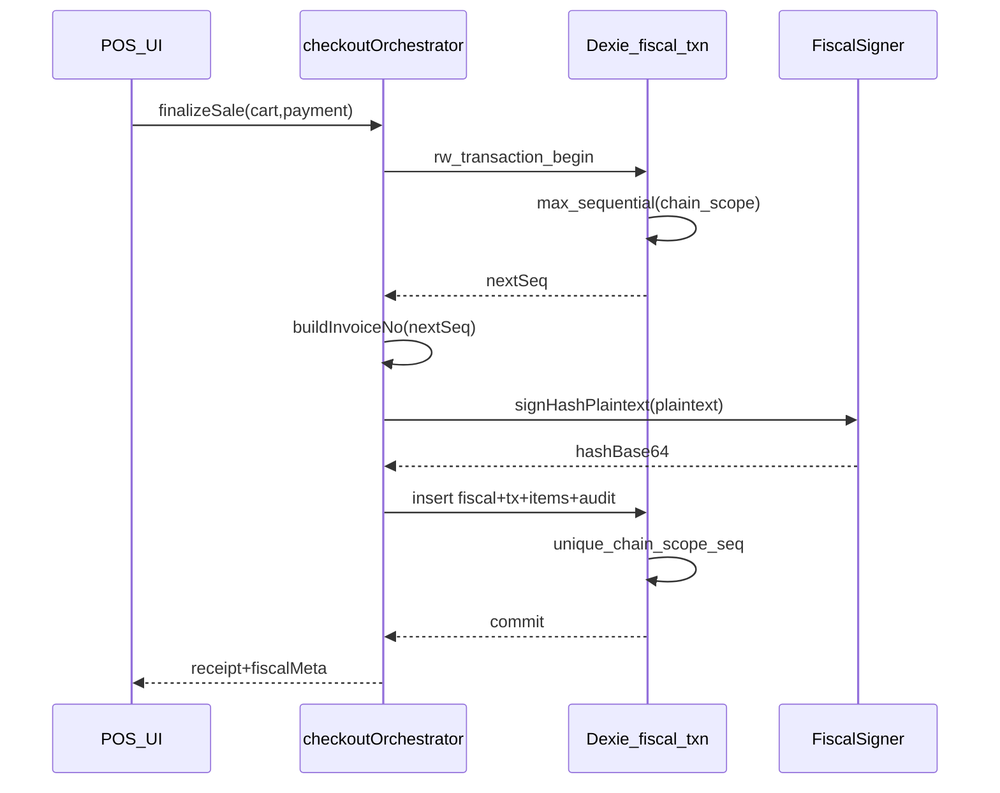

# AT certification: key custody, sequential integrity, remaining gaps

## 1) Asymmetric key: server-only vs offline POS

**Regulatory intent (practical reading):** The AT / certification narrative (“chave privada de conhecimento exclusivo do produtor”) is about **control and non-exfiltration**, not a literal mandate that signing bytes must live only on a Linux server. If the terminal finalizes the invoice **offline**, the signature must be produced **on that terminal** (or on a co-located secure module), not on a distant server you cannot reach.

**Answer to “must it be server-only?”** **No** for an offline-capable POS, **provided** the certified product design documents equivalent controls: key not extractable by the operator, integrity of the signing implementation, and rotation/revocation procedures the AT accepts.

**Recommended architecture (aligned with your options):**

- Keep the existing [`FiscalSigner`](src/fiscal/signing.ts) abstraction (`WebCryptoRsaSha1Signer`, `RemoteFiscalSigner`).
- **Online-only / central signing:** extend `RemoteFiscalSigner` to call a backend that holds the key (HSM or cloud KMS) — best when online is guaranteed.
- **Offline-capable Electron:** store **no raw PKCS#8 PEM in `localStorage`**. Instead:
  - **Preferred:** Electron **main process** + [`safeStorage`](https://www.electronjs.org/docs/latest/api/safe-storage) (wraps OS keychain/DPAPI) to encrypt a small blob (wrapped key or PKCS#8 ciphertext); preload exposes IPC `signFiscalPayload(plaintext)` so the **renderer never sees the private key**; signing runs in main or a utility process with the decrypted key only in memory for the operation.
  - **Stronger (later):** platform keystore / TPM via native addon (Windows TPM, macOS Secure Enclave) — higher effort; document as a phase-2 hardening.
- **Browser-only (no Electron):** options are weaker (password-wrapped key in IndexedDB, or non-extractable `CryptoKey` generated once per install — public key export for AT submission still possible). Call out as **not equivalent** to Electron+OS keystore in a security questionnaire.

**Documentation:** Note in [`AGENTS.md`](AGENTS.md) or internal cert pack: “signing locus” (server vs Electron secure IPC) is a **certification design choice**, not a contradiction with offline.

---

## 2) Sequential numbering — what “partial / gaps” meant (and the fix)

**What was wrong in the earlier review (“partial”):**

| Issue | Why it matters |
|--------|----------------|
| **TOCTOU / race** | [`runFiscalCheckout`](src/fiscal/checkoutOrchestrator.ts) calls [`getLastFiscalDocumentInChain`](src/lib/localDatabase.ts) **then** later [`createTransactionWithFiscal`](src/lib/localDatabase.ts). Two concurrent sales (two tabs, two windows, or two tills sharing one IndexedDB profile — rare but possible) can read the **same** max and emit the **same** `sequential_number` / `InvoiceNo` / ATCUD suffix. There is **no unique index** on `(chain_scope, sequential_number)` today ([schema v5](src/lib/localDatabase.ts) indexes `chain_scope` and `sequential_number` separately, not compound-unique). |
| **“Gaps” vs “holes”** | **Abandoned checkout** does **not** consume a number today (number is chosen only when persisting) — so you do **not** get fiscal “holes” from cancelled carts. The risk was **duplicates / forked state**, not missing integers. |
| **`currentNumber` in settings** | Updated in [`POSContext`](src/contexts/POSContext.tsx) **after** a successful checkout. It is a **cache** for UX / bootstrap; the **source of truth** for the next number must be **`fiscal_documents` max per `chain_scope`**, not `localStorage` alone. |

**Fix (this is the important part):**

1. **Allocate `sequential_number`, build `invoice_no`, compute hash, and insert** fiscal + transaction + items + audit inside **one** `localDb.transaction('rw', [...])` callback in [`transactionLocalService`](src/lib/localDatabase.ts) (or a new dedicated method e.g. `createFiscalSaleAtomic(...)` used by checkout).
2. **Inside that transaction**, compute `next = max(sequential_number where chain_scope = X) + 1` (or `1` if none). Use that for `invoice_no`, plaintext hash, ATCUD body, then `add` rows.
3. **Dexie schema v6:** add a **unique** compound index on fiscal documents, e.g. `&[chain_scope+sequential_number]` (Dexie `&` = unique). On upgrade, **scan for duplicates**; if found, surface a blocking admin error (data repair) rather than silent merge.
4. **Refactor** [`runFiscalCheckout`](src/fiscal/checkoutOrchestrator.ts): move “persist” to the atomic API; keep pure functions for totals, plaintext, QR payload **above** the transaction, but **invoice number and signing** that depend on the allocated sequence should run **after** allocation inside the same transactional flow (async Dexie transaction is supported).
5. **Multi-device / multi-store:** one physical DB cannot enforce global uniqueness across two laptops. **Document** the certified deployment rule: **one active emitter per `(NIF, establishment, series, AT validation code)`**, or introduce a **server-side sequence** (Supabase RPC + row lock) when online, with offline queue + conflict UI (larger project — flag as phase 2 if you need true multi-till).

**Tests:** add Vitest cases: two parallel `createFiscalSaleAtomic` calls (same `chain_scope`) must yield distinct `sequential_number`s; simulate concurrent Dexie transactions if feasible, or test the allocation helper with a mocked store.

---

## 3) “Everything / every paragraph” — remaining gaps (phased)

Following the prior PDF audit, treat work as **phases** so each phase is shippable and testable.

### Phase A — Certification blockers (with sequential + fiscal correctness)

- **Customer NIF on fiscal / QR / SAF-T:** fix inverted logic in [`checkoutOrchestrator.ts`](src/fiscal/checkoutOrchestrator.ts) (`customer_tax_id` when `selectedCustomer` is set) and add **`tax_id` (or `vat_number`)** to [`CustomerRow`](src/types/supabase.ts) + local DB + forms + sync mappings as needed; pass NIF into [`buildAtQrPayloadString`](src/fiscal/qrPayload.ts) field `B:`.
- **Discount guards:** in [`runFiscalCheckout`](src/fiscal/checkoutOrchestrator.ts), reject **global fixed** discount when `amount > subtotalAfterItemDiscounts` (and any path that would make `grossTotal <= 0` on non-credit documents).
- **Legal footer wording:** align receipt with PDF p.9 — use **“Processado por programa certificado n.º … /AT”** in [`ThermalReceipt.tsx`](src/components/ThermalReceipt.tsx) and update [`tests/thermal-receipt-label.test.tsx`](tests/thermal-receipt-label.test.tsx).
- **SAF-T shell vs PDF structure:** add empty **`<GeneralLedgerEntries/>`** (or minimal valid block per XSD you validate against) between `MasterFiles` and `SourceDocuments` in [`exportSaft.ts`](src/fiscal/saft/exportSaft.ts), and validate XML against the official **PT_1.04_01** XSD in CI or a npm script.
- **Export de-duplication (PDF suggestion):** add optional `exported_at` / `saft_export_batch_id` on fiscal rows (Dexie + Supabase migration) set when a date-range export completes; filter or mark in SAF-T `DocumentStatus` only if spec allows (confirm against XSD before writing fields).

### Phase B — Document types and rectifications

- **NC (and later ND/FR)** end-to-end: dedicated checkout path reusing the same **atomic** fiscal writer, `InvoiceType` `NC`, negative totals rules, reference to original invoice, hash chain continuation — align with your existing plan file if present under [`.cursor/plans/`](.cursor/plans/).
- **Void vs credit:** keep **no physical delete** for fiscal-linked transactions ([`deleteTransaction`](src/lib/localDatabase.ts) already throws); ensure any “void” UI only uses audit + NC.

### Phase C — Integrations, alerts, polish

- **Non-certified imports:** if not in scope, document “not supported”; if in scope, add explicit document type + `Hash` empty + audit flag as per AT guidance.
- **Risk alerts:** discontinued series (already throws), duplicate manual registration attempts, etc. — small UX hooks in [`Settings.tsx`](src/pages/Settings.tsx) / POS.
- **Original + cópia:** explicit print flow or second print button with label “Cópia / Duplicado” using [`ThermalReceipt`](src/components/ThermalReceipt.tsx) `documentLabel`.

### Phase D — Key storage hardening (Electron)

- Implement **IPC signing** path and migrate settings UI to **import once**, store encrypted, never show PEM again in renderer.
- **Follow** [`DEVELOPMENT_GUIDE.md`](DEVELOPMENT_GUIDE.md) component order and [`STYLE_GUIDE.md`](STYLE_GUIDE.md) for any new settings UI (touch targets, functional colors).

---

## Architecture sketch (sequential + signing)

---

## What we are explicitly **not** claiming

- Full **legal** sign-off on Portarias / XSD without running official validators and AT test cases.
- **TPM** support in phase D without extra native dependencies (call out as optional).

---

## Suggested implementation order

1. **Atomic sequential + unique index + tests** (highest priority).
2. Customer NIF + discount guard + “Processado” + SAF-T `GeneralLedgerEntries` stub.
3. NC flow + export flags (if XSD confirms).
4. Electron secure signing IPC.
