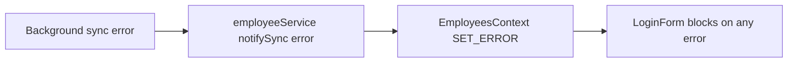

# Offline-first resilience: split load vs sync errors

## Goals (aligned with your priorities)

- **Fiscal / integrity:** Unchanged rules: till remains first writer; no silent rewrite of sealed docs. This work only changes **how failures are classified in UI state**, not fiscal logic.
- **App keeps working:** When Supabase is paused, DNS fails, or sync throws, the user can still **see local employees on login** and **use the POS with the last-synced local catalog** (or empty catalog), not a full-screen “broken app.”

## Root cause (current behavior)

- [EmployeesContext.tsx](src/contexts/EmployeesContext.tsx) maps **sync** callback `status === 'error'` to the **same** `error` field as `loadEmployees()` failure (`SET_ERROR` with `Sync failed: ...`).
- [LoginForm.tsx](src/components/Auth/LoginForm.tsx) treats **any** `employeesContext.error` as a **full-screen hard stop** (lines 133–151), so a non-blocking background sync failure **blocks the entire login UI**.
- [ProductsContext.tsx](src/contexts/ProductsContext.tsx) `syncData()` catch sets `SET_ERROR` to `'Sync failed'` (lines 437–440). [POS.tsx](src/pages/POS.tsx) hides the product grid when `error` is truthy (lines 645–672), so a **background sync failure can blank the catalog** even when **local** `loadData()` succeeded.
- **Secondary risk:** [ProductsContext.tsx](src/contexts/ProductsContext.tsx) `loadData()` reads `localDb.products` / `localDb.categories` without awaiting [initializeLocalDatabase()](src/lib/localDatabase.ts) (unlike [employeeService.ts](src/services/employeeService.ts) which goes through `ensureInitialized()`). On cold start, that can race bootstrap / first `open()` and surface as spurious “failed to load” errors.

## Design: two error channels

| Channel | Meaning | Login / POS |
|--------|---------|-------------|
| **loadError** (or keep `error` name but **only** for this) | IndexedDB not open, read threw, or other **local** catalog/employee read failure | **Blocking** (retry, clear data guidance as today) |
| **syncError** (or `lastSyncError` + timestamp) | `performSync` / `productSyncService.fullSync` failed | **Non-blocking**: banner, optional dismiss, `forceSync` / retry; **do not** clear local data or block core flows |

Sync success/failure should **not** call `SET_ERROR` for the load channel.

## Implementation plan

### 1. Employees context API and reducer

**File:** [src/contexts/EmployeesContext.tsx](src/contexts/EmployeesContext.tsx)

- Extend state: e.g. `loadError: string | null` and `syncError: string | null` (or `syncStatusLastError` + `syncFailedAt`), keep `error` as deprecated alias only if needed for a short migration (prefer **remove** `error` and update all call sites in one pass).
- **`loadEmployees`:** on catch, set **only** `loadError` (not `syncError`). On success, clear `loadError`.
- **`handleSyncStatusChange`:** for `status === 'error'`, set **only** `syncError` (and maybe `lastSyncFailedAt`); **do not** set `loadError`. For `completed`, optional: clear `syncError` on success; refresh list as today.
- **CRUD methods** that today use `SET_ERROR` for user-visible failures: keep mapping to **loadError** or a dedicated **mutationError** if you want to avoid conflating with “could not list employees” (minimal approach: use **loadError** only for `loadEmployees`; CRUD can keep a single `error` field renamed to `operationError` or continue using the same `loadError` with clear i18n—team choice; **do not** route sync into that field).
- Expose: `clearLoadError` / `clearSyncError` (or one `clearError` that clears load only and separate `dismissSyncWarning`).

**Type surface:** extend `EmployeesContextType` in the same file per [DEVELOPMENT_GUIDE.md](DEVELOPMENT_GUIDE.md) (explicit interfaces, no `any` for new fields).

### 2. Login screen: block only on load failure

**File:** [src/components/Auth/LoginForm.tsx](src/components/Auth/LoginForm.tsx)

- Replace `employeesContext.error` checks for the **blocking** view with **`loadError`** (or the chosen name).
- If `syncError` is set and `loadError` is not, show the **normal** employee selection UI and add a **non-blocking** strip (e.g. bottom or top): “Could not reach server; you can still sign in with local staff” + optional dismiss (uses `clearSyncError`). Follow [STYLE_GUIDE.md](STYLE_GUIDE.md) for touch targets and functional colors (warning strip, not full-page red for sync-only).
- **Retry** button on the **load-failure** screen should call `refreshEmployees()` and clear only load errors as appropriate.

### 3. Other consumers of `useEmployees` error

**Grep-driven updates:** [src/pages/Employees.tsx](src/pages/Employees.tsx) and any component that displayed `error` from employees—point them to `loadError` / `operationError` / `syncError` intentionally.

**Files to verify:** [src/contexts/EmployeesContext.tsx](src/contexts/EmployeesContext.tsx) (internal hooks at bottom if they export error), [AuthContext.tsx](src/contexts/AuthContext.tsx) only uses `employees` list—not error UI.

### 4. Products context: split sync failure from catalog load failure

**File:** [src/contexts/ProductsContext.tsx](src/contexts/ProductsContext.tsx)

- Add `syncError: string | null` (and optionally `lastSyncAt` already partially represented by `syncStatus.lastSync`).
- **`loadData`:** failures stay **catalog/load** errors (i18n `pos.failedToLoadData`).
- **`syncData`:** on catch, set **only** `syncError`, **never** the same field used for catalog load failure. Optionally clear `syncError` at start of successful sync.
- **`initializeLocalDatabase`:** at the start of `loadData`, `await initializeLocalDatabase()` imported from [src/lib/localDatabase.ts](src/lib/localDatabase.ts) so Dexie is open before `localDb.products` / `categories` queries (same single-flight init used elsewhere).

**Interface:** extend `ProductsContextType` / reducer state accordingly.

### 5. POS page: catalog blocking vs sync banner

**File:** [src/pages/POS.tsx](src/pages/POS.tsx)

- Destructure `loadError` + `syncError` (or `error` + `syncError`) from `useProducts()`.
- **Blocking full-screen error:** only when **catalog could not be read from local DB** (load error), same UX as today (retry / sync button can remain for recovery).
- **Sync-only failure:** show an **inline banner** above the grid (or compact strip), allow continuing to sell with **stale** local catalog; “Retry sync” action calls `syncData` or `refreshData` as appropriate.

### 6. i18n

**File:** [src/i18n.ts](src/i18n.ts) (or locale files if split)

- Add strings for: sync-degraded banner title/body, dismiss, “server unreachable” login strip (EN + PT if the project maintains both).

### 7. Tests and verification

- **Manual:** pause Supabase project (or block DNS to host), reload app: login shows employees from Dexie/bootstrap; POS shows catalog from local data; banner indicates sync issue without hiding grid.
- **Automated (optional but valuable):** Vitest unit tests for `employeesReducer` / products reducer dispatch sequences: “sync error does not set loadError”; “load failure sets loadError.”

### 8. Documentation (lightweight, 2.0 branch)

- Add a short subsection to [AGENTS.md](AGENTS.md) or a dedicated `docs/offline-ux.md` (your choice): **load vs sync error semantics** and **UI rule**: sync failure never blocks till login or local catalog display.

## Out of scope (later phases)

- Global **trust strip** (A/B/C layers) across all routes.
- Export/backups of queue / snapshots (previous conversation).
- Changing `ConnectionStatus` ping interval or enterprise allowlist (unless you want fewer console warnings—optional).

## Risk notes

- Clearing **`syncError`** on dismiss must not hide **loadError**.
- After refactor, ensure **no code path** sets the **load** error field from `employeeService.notifySync('error')`.
