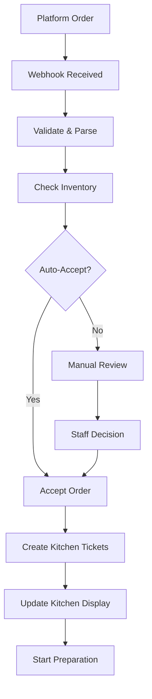
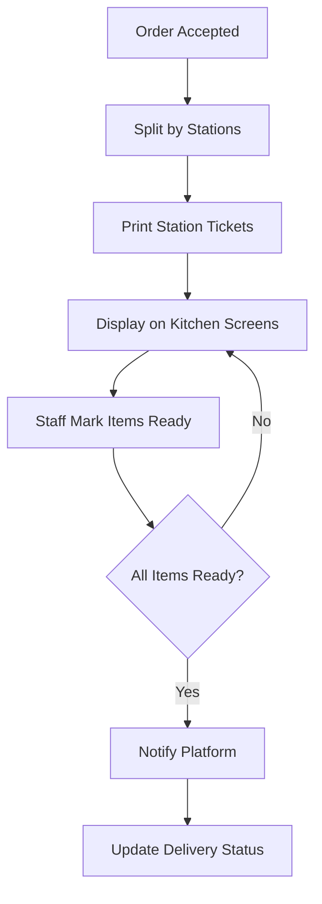

# 🔧 **DELIVERY PLATFORMS TECHNICAL SPECIFICATIONS**

## **📱 DELIVERY PLATFORM INTEGRATION DETAILS**

### **Glovo Integration:**

```typescript
interface GlovoOrder {
  order_id: string;
  store_id: string;
  order_time: string;
  estimated_pickup_time: string;
  customer: GlovoCustomer;
  items: GlovoOrderItem[];
  payment_method: string;
  total_amount: number;
  delivery_fee: number;
  status: 'received' | 'confirmed' | 'preparation' | 'ready' | 'picked_up';
}

interface GlovoCustomer {
  name: string;
  phone?: string;
  special_instructions?: string;
}

interface GlovoOrderItem {
  id: string;
  name: string;
  quantity: number;
  price: number;
  modifiers?: Array<{
    name: string;
    price: number;
  }>;
  special_instructions?: string;
}

// Webhook endpoints needed:
POST /webhooks/glovo/orders        -- New orders
POST /webhooks/glovo/status        -- Status updates
POST /webhooks/glovo/cancellation  -- Order cancellations
```

### **Uber Eats Integration:**

```typescript
interface UberEatsOrder {
  id: string;
  store_id: string;
  placed_at: string;
  estimated_ready_for_pickup_at: string;
  eater: UberEatsCustomer;
  cart: UberEatsCartItem[];
  payment: UberEatsPayment;
  total: UberEatsTotal;
  current_state: 'created' | 'accepted' | 'denied' | 'finished' | 'cancelled';
}

interface UberEatsCustomer {
  first_name: string;
  last_name: string;
  phone?: string;
}

interface UberEatsCartItem {
  id: string;
  instance_id: string;
  title: string;
  quantity: number;
  price: number;
  customizations?: Array<{
    title: string;
    price: number;
  }>;
  special_instructions?: string;
}

// API endpoints needed:
GET  /v1/eats/stores/{store_id}/orders     -- Fetch orders
POST /v1/eats/orders/{order_id}/accept_pos -- Accept order
POST /v1/eats/orders/{order_id}/deny_pos   -- Deny order
POST /v1/eats/orders/{order_id}/ready      -- Mark ready
```

---

## **🔄 SYNCHRONIZATION STRATEGY**

### **Product Catalog Sync:**

```typescript
interface PlatformProductMapping {
  local_product_id: string;
  platform: 'glovo' | 'ubereats';
  platform_product_id: string;
  platform_price?: number;      // Different pricing per platform
  availability: boolean;
  last_synced: string;
}

// Sync scenarios:
1. Manual upload to platforms (one-time setup)
2. Price/availability updates (real-time)
3. New product additions (manual approval)
4. Stock depletion (automatic disable)
```

### **Order Data Flow:**

```typescript
// Real-time synchronization:
Platform Orders → Local Database → Kitchen Display → Staff Updates → Platform Status
                ↓
            POS Integration (for unified reporting)
                ↓
            Transaction Records (for analytics)
```

---

## **📊 ORDER FLOW INTEGRATION**

### **Incoming Order Process:**



### **Kitchen Workflow:**



---

## **🔐 SECURITY CONSIDERATIONS**

### **Webhook Security:**

✅ **Signature Verification**: Validate platform webhooks  
✅ **Rate Limiting**: Prevent webhook spam  
✅ **HTTPS Only**: Secure communication  
✅ **IP Whitelisting**: Restrict webhook sources

### **Data Privacy:**

✅ **Customer Data**: Minimal storage, compliance with GDPR  
✅ **Payment Info**: Never store card details  
✅ **Staff Access**: Role-based permissions for delivery orders

---

## **📊 REPORTING INTEGRATION**

### **Enhanced Analytics:**

```typescript
interface DeliveryMetrics {
  platform_orders: Record<string, number>; // Orders per platform
  preparation_times: Record<string, number>; // Average prep time per product
  station_efficiency: Record<string, number>; // Performance per kitchen station
  order_accuracy: number; // Completion rate
  customer_ratings: Record<string, number>; // Platform ratings
}
```

### **Unified Reporting:**

- Combine POS and delivery sales
- Station performance metrics
- Platform comparison analytics
- Staff efficiency across channels

---

## **🎯 SUCCESS METRICS**

### **Operational:**

✅ **Order Processing Time**: < 2 minutes from receipt to kitchen  
✅ **Kitchen Efficiency**: Real-time status tracking  
✅ **Platform Integration**: 99%+ webhook success rate  
✅ **Staff Adoption**: Unified workflow with existing POS

### **Business:**

✅ **Revenue Growth**: Track delivery vs. in-store sales  
✅ **Customer Satisfaction**: Platform rating improvements  
✅ **Operational Efficiency**: Reduced order processing time  
✅ **Staff Productivity**: Cross-channel performance metrics
